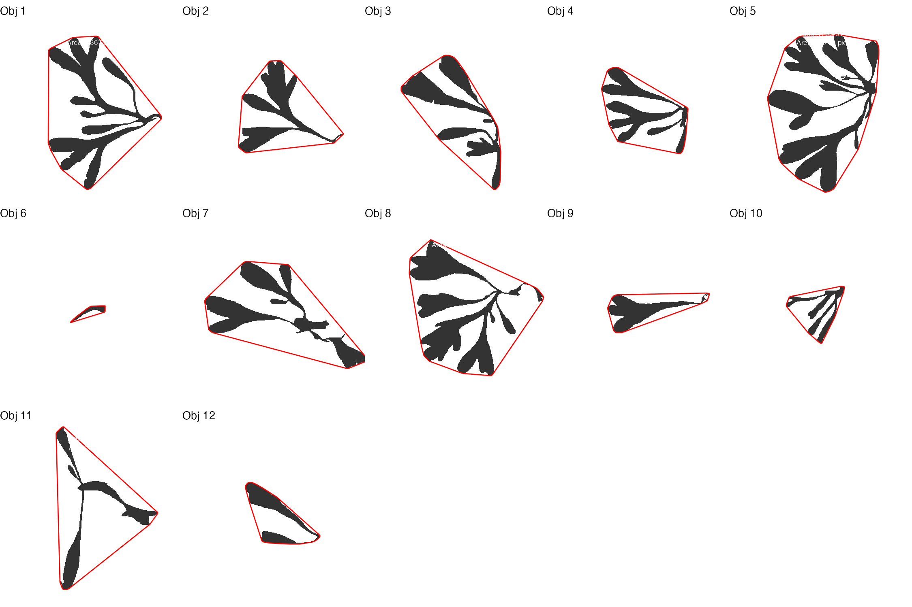
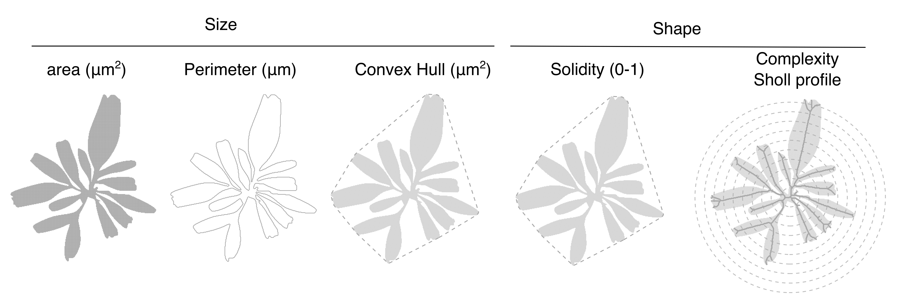

# PhycoSeg
A UNet-based pipeline for quantitative algal morphology






## Install


Create and activate a fresh conda environment:

```bash
conda create -n seaweed_unet python=3.12 -y
conda activate seaweed_unet
```

Once inside the new conda, install some python dependencies

```bash
conda install pytorch torchvision torchaudio cpuonly -c pytorch -y
pip install numpy==1.26.4 opencv-python pillow tqdm matplotlib

```

## Usage

Organize your dataset as follows

```bash
./data/ 
├── images/    # input images (e.g. .jpeg, .png) 
└── masks/     # binary masks with same filenames (foreground = white, background = black) 
```

Train the UNET model on training dataset (images and respective masks)

```bash
python unet-palmaria.py train \
  --data_dir ./data \
  --out_dir ./seaweed_v1 \
  --epochs 10 --img_size 1600 1200 --batch_size 1 --lr 3e-4 --val_split 0.15 \
  --no_save
```

Predict/Infer objects using the trained model 

```bash
python unet-palmaria.py infer \
  --ckpt ./runs/seaweed_v1/best.pt \
  --input_dir ./data/images \
  --output_dir ./seaweed_preds \
  --threshold 0.5 \
  --save_overlay
```


You can expand a small dataset with synthetic variations

```bash
python augment-images.py  
  --images ./data/images  
  --masks ./data/masks  
  --out_images ./data/aug_images  
  --out_masks ./data/aug_masks  
  --num 10 
```